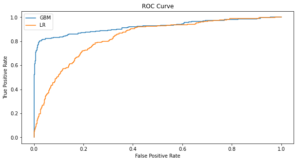
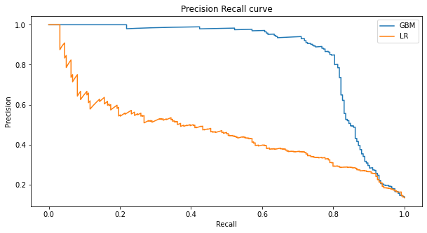
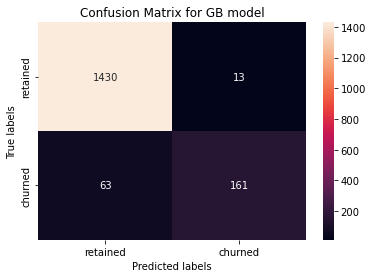
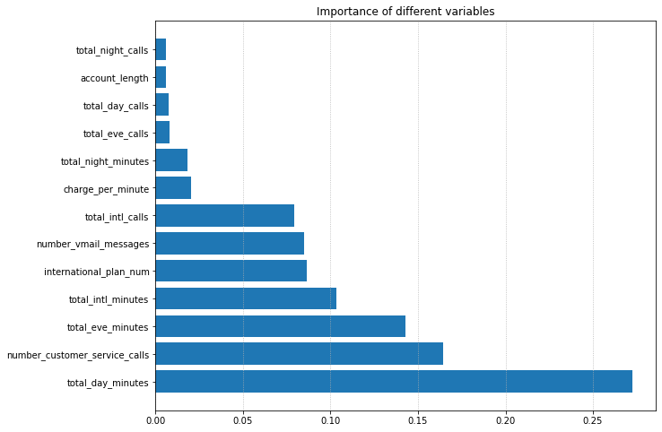

# Predict the customer churn of a telecom company and find out the key drivers that lead to churn

## About the Project

Every company wants to increase its revenue and profitability. To do that, while acquiring new customers, they also want to ensure that the existing ones stay with them for a long time. Also, it's strategically important to know beforehand whether a set of customers are planning to stop using their services (especially recurring ones like internet, cable, phone, etc.). To do that, every company or business creates and tracks customer metrics which are then used to predict the likelihood of churn.

Customer Churn for a company occurs when a customer decides to stop using the services of that company. In this Data Science classification project, I will be using the customer data of a telecom sector company based in the US to predict the probability of churn for each customer. I will look at the standard practices that are followed in the industry to solve these problems and also go beyond just those techniques. I have chosen the telecom company data for the churn problem as it is a major area of concern for companies in that sector.

Once I have built a model, the churn model output can also be used as a warning indicator that some customers are likely to churn. The key drivers making the customer more likely to churn can be alleviated and ensure that the customers are retained.

## Dataset

The dataset used is an anonymized synthetic data that was generated specifically for use in this project. The data from kaggle is designed to exhibit similar characteristics to genuine telecom customer data.

## Data Description

The data description for the csv file is shown below:

| Column                    | Description                                                                        |
| ------------------------- | -----------------------------------------------------------------------------------|
| `State`           | A categorical variable indicating which state the customer comes from in the US        |
| `Account length`                  | The number of days the customer has been with the telco firm                      |
| `Area code`                      | A geographical variable representing area code              |
| `International plan`                     | If the customer has a internatoinal plan or not (Yes/No)  |
| `Voice mail plan`                     |If the customer has a voice mail plan or not (Yes/No)        |
| `Number of vmail_Messages`           | The total number of voice mail messages    |
| `Total day minutes`                      |The total number of minutes consumed in a day time|
| `Total day calls`                     | Total calls made during day time |
| `Total day charge`                     | Total day charge in dollars   |
| `Total evening minutes`                     | Total minutes spent making call in the evenings  |
| `Total evening calls`                     | The total number of calls made in the evenings  |
| `Total night minutes`                     | The total number of calls made in the night  |`Total night charges`                     | Total charges in the night  |
| `Total night calls`                     | A number representing the total night calls of the customer |
| `Total night charges`                     | Dollar amount representing the cost of all night calls  |
| `Total intl minutes`                     | Total minutes spent making international calls  |
| `Total intl charge`                     | The total cost of making international calls  |
| `Number customer service calls`                     | How many times the customer has called the service center  |
| `Churn`                     | If the customer has churned or not (Yes/No)  |

## Methodology & Results

After preparing the data, I decided to use the Logistic Regression model for this project because this is a binary classification problem seeking to answer whether the customer will churn. Logistic regression is a type of supervised machine learning classification algorithm used to predict the probability of a categorical dependent variable. It is typically used when there is a binary outcome (e.g., success/failure, yes/no, win/loss, sick/healthy). Logistic regression can also be used to predict multiple categories of dependent variables.

Logistic regression is extensively used in churn prediction projects, hence the first model I chose. I decided to use Logistic regression with hyperparameter tuning. Hyperparameter tuning is the process of optimizing the hyperparameters of a model to improve its performance. Hyperparameters are parameters set before the learning process begins and are not adjusted during training. Examples of hyperparameters include:

* The learning rate.
* The number of hidden layers.
* The number of neurons in each layer.
* The activation function.
* The batch size.

A model can be optimized by tuning these values to maximize its performance.

I used the GridSearchCV for the logistic regression model using a cross-validation (cv) of five. The default is three, but I took a higher value of five to ensure that more data is present in each training fold. GridSearchCV is an exhaustive search over specified parameter values for an estimator. It is a way of systematically working through multiple combinations of parameter values and cross-validating to determine which combination of parameters gives the best performance. GridSearchCV can be used for all kinds of parameter tuning, such as finding the best model complexity, the best number of features, and the best algorithms for a specific dataset.

## Running the Logistic Regression Models

The result of running the logistic regression with hyper-parameter tuning gave the optimal parameters below.

 ```text
 LogisticRegression(C=3, penalty='l1', random_state=42, solver='liblinear')
 ```

The output from a linear regression model with hyper-parameter tuning means that the model has been tuned to optimize the model's performance by adjusting the regularization strength ***(C)*** to ***3*** and penalty type ***l1*** for logistic regression. The ***random_state*** parameter has been set to ***42***, and the solver is ***'liblinear'***.

Before moving into the performance of the Logistic Regression Model, I decided to look at how the data will perform using the Gradient Boosting Model to compare them side by side.

## Running the Gradient Boosting  Classifier

Gradient boosting classifier is an ensemble machine learning algorithm that combines multiple weak learners to create a more robust predictive model. It works by sequentially adding decision trees to the model, each of which attempts to correct the errors made by the previous tree. The algorithm then looks for the optimal tree combination that minimizes the overall error rate of the model. This technique is widely used in various applications, such as predicting sales, customer churn, and credit risk.

The result of running the Gradient Boosting Classifer with hyper-parameter tuning gave the optimal parameters below.

```text
GradientBoostingClassifier(learning_rate=0.05, max_features=1.0,
                           n_estimators=500, random_state=42)
```

This particular model has a learning rate of 0.05, a maximum number of features of 1.0, and 500 estimators (individual models). The random_state parameter is set to 42, which ensures that the results are reproducible each time the model is run.

## Preformance Tuning

There are several methods for assessing the performance of a machine learning model. These include accuracy, precision,confusion matrix, recall, F1 score, ROC curve, and logarithmic loss. Each of these metrics has advantages and disadvantages and should be used in combination to evaluate the model's overall performance. Accuracy measures the number of correct predictions made by the model, while precision measures the ratio of true positives to false positives. Recall measures the ratio of true positives to false negatives, and F1 score combines precision and recall. The ROC curve measures the true positive rate against the false positive rate and can be used to compare different models. Finally, logarithmic loss measures the performance of a model in terms of the probability of correctly classifying an example.

The results below are the average precision score and roc auc score for both models.

```text
Area Under ROC and PR curves for LR model

roc auc score: 0.83375099000099
avg precision score: 0.46123237781890525
```

```text
Area Under ROC and PR curves for GB model

roc auc score: 0.9215733590733591
avg precision score: 0.8505233699277284
```

The above results show that the Gradient Boosting Classifier gave an AUC ROC Score of 0.92 against 0.83 from the Logistic Regression model. Also, the average precision score for Gradient Boosting is approximately 0.85, whereas Logistic Regression returned a very low average precision score of  0.46. Looking at these two metrics, we see that the Gradient Boosting model achieved much better results.

The graph below compares the ROC curves to see how these models performed. Again, the ROC curve is a graphical representation of the performance of a classification model at all threshold settings. The ROC curve plots the true positive rate (TPR) against the false positive rate (FPR). It is used to evaluate the trade-off between a test or model's sensitivity (true positives) and specificity (false positives).



From the True Positive Rate (TPR) vs. False Positve Rate (FPR) graph, the blue line, GradientBoosting, has the highest area under the curve. That is measured by the line, which is farther out than the Logistic Regression model.



The plot above shows the precision-recall curve. The precision-recall curve is a graphical representation of a model's precision and recall scores for various thresholds. The precision-recall curve is used to evaluate a model's ability to identify and distinguish relevant data points from irrelevant ones correctly. The x-axis of the curve is the recall score, and the y-axis is the precision score. The optimal point on the curve is the point where the precision and recall scores are highest. In this case, the GB model wins. Next, I took a look at the confusion matrix.



The GB model predicted correctly that 1,430 customers would be retained (True negative) and 161 customers would churn out (True Positive). For 63 customers, the model had predicted that they would be retained; however, they churned (False negative). And lastly, we predicted that 13 customers would churn out, but they were kept (False positive).

The LR model gave an accuracy score of 0.87, whereas the GB classifier recorded an accuracy score of 0.95.

## Extended Analysis

For this customer churning prediction problem, I decided to report on the top 10% of customers who are likely to churn and share with appropriate departments so that the necessary follow-up can be done to ascertain which problems they are facing with the company's services. This will help create strategies to retain them rather than see them leave the company.

To generate this report, I took the model scores obtained by each customer in the Gradient Boosting classifier and did a sort in descending order using the model score and kept the top 10% of the data. These will be the customers that the company will contact and try to retain.

```text
1    157
0     10
Name: churn_num, dtype: int64
```

The output shows that 167 people who were likely to churn were selected in the top 10 percent. And out of these people, 157 are churning.

## Recursive Feature Elimination

The current model has 65 features. I used the recursive feature elimination method to determine which features could be removed from the model without impacting performance.

Recursive feature elimination (RFE) is a feature selection technique that uses a machine learning model to determine which attributes (features) contribute most to the prediction accuracy of the model. It works by recursively eliminating the least important features one-by-one until only the most important features are left. The remaining features are then used to train the model.

The feature importance table revealed that removing the state and area code variables from the model would not affect its predicting power. The state and area code contributed a total of ***52*** features. Dropping them leaves us with ***13*** features which I then used to retrain the model.

```text
Area Under ROC and PR curves for GB RFE model

roc auc score: 0.9246207058707059
avg precision score: 0.8531759770164754
```

From the output above, The new GB model with reduced features (13) gave a roc auc score and an average precision score of 92.46% and 85.32%, respectively. In contrast, the GB classifier with 65 features recorded a roc auc score and an average precision score of 92.15% and 85.05%, respectively, showing a slight improvement in the reduced model compared to the former.

The table below shows the feature importance of the reduced GB model with their model score.

```text
                          feature  importance  cum_importance
1               total_day_minutes    0.272474        0.272474
2   number_customer_service_calls    0.164575        0.437049
3               total_eve_minutes    0.142622        0.579671
4              total_intl_minutes    0.103507        0.683177
5          international_plan_num    0.086615        0.769792
6           number_vmail_messages    0.085081        0.854873
7                total_intl_calls    0.079423        0.934297
8               charge_per_minute    0.020389        0.954685
9             total_night_minutes    0.018003        0.972688
10                total_eve_calls    0.007990        0.980678
11                total_day_calls    0.007213        0.987891
12                 account_length    0.006065        0.993956
13              total_night_calls    0.006044        1.000000
```



The graph above indicates that charges associated with calls during the day could be the key driver of churn, followed by the number of customer service calls and the charges related to evening calls in that order.

## Model Implementation

I created a pickle file for the model and the model columns.
Use the **churn_API.py** file to predict on new data.

## Test the churn_API

To test the churn_API:

1. Run the **churn_API** server flask app
2. Run the **test.py** with the new data to request results from the API

## Directory Structure

The directory structure for the repository has been shown below in the form of a tree.

```text
.
├── data
│   ├── telecom_test.csv
│   └── telecom_train.csv  
│ 
├── plots
│   ├── confusion_matrix.png
│   ├── key_drivers_of_church.png
│   ├── precision_recall_curve.png
│   └── roc_curve.png
│ 
├── src
│   ├── churn_API.py
│   ├── test.py
│   └── main.py
│ 
├── model
│   ├── model_columns.pkl
│   └── model.pkl
│
├── test_output
│   └── Output_Test.csv
│ 
├── README.md
└── LICENSE

```

## License

This code is available under the [MIT License](LICENSE)

Wikimedia [Terms of Use](https://foundation.wikimedia.org/wiki/Terms_of_Use/en)
